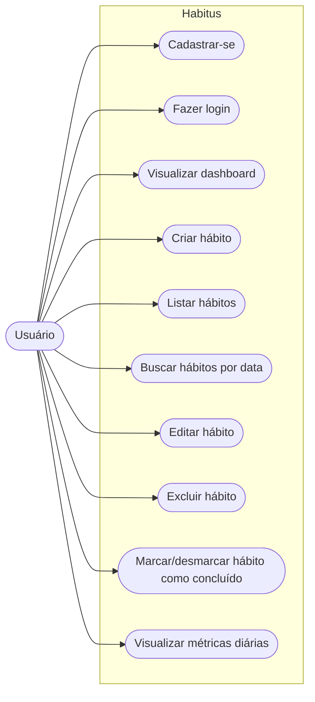

# Diagrama de Casos de Uso

Este diagrama apresenta as principais ações disponíveis para o usuário no sistema Habitus.

```mermaid
flowchart LR
    Usuario([Usuário])

    subgraph Sistema[Habitus]
        UC1([Cadastrar-se])
        UC2([Fazer login])
        UC3([Visualizar dashboard])
        UC4([Criar hábito])
        UC5([Listar hábitos])
        UC6([Buscar hábitos por data])
        UC7([Editar hábito])
        UC8([Excluir hábito])
        UC9([Marcar/desmarcar hábito como concluído])
        UC10([Visualizar métricas diárias])
    end

    Usuario --> UC1
    Usuario --> UC2
    Usuario --> UC3
    Usuario --> UC4
    Usuario --> UC5
    Usuario --> UC6
    Usuario --> UC7
    Usuario --> UC8
    Usuario --> UC9
    Usuario --> UC10
```
