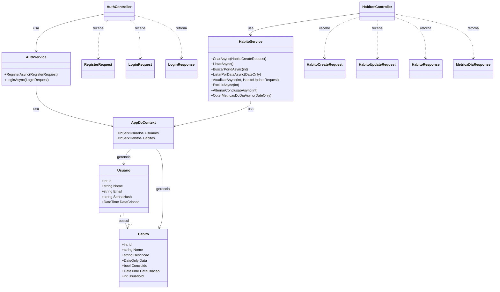

# Diagrama de Classes

Este diagrama mostra as principais classes do backend do Habitus e seus relacionamentos.

```mermaid
classDiagram
    class Usuario {
        +int Id
        +string Nome
        +string Email
        +string SenhaHash
        +DateTime DataCriacao
    }

    class Habito {
        +int Id
        +string Nome
        +string Descricao
        +DateOnly Data
        +bool Concluido
        +DateTime DataCriacao
        +int UsuarioId
    }

    class AuthController
    class HabitosController

    class AuthService {
        +RegisterAsync(RegisterRequest)
        +LoginAsync(LoginRequest)
    }

    class HabitoService {
        +CriarAsync(HabitoCreateRequest)
        +ListarAsync()
        +BuscarPorIdAsync(int)
        +ListarPorDataAsync(DateOnly)
        +AtualizarAsync(int, HabitoUpdateRequest)
        +ExcluirAsync(int)
        +AlternarConclusaoAsync(int)
        +ObterMetricasDoDiaAsync(DateOnly)
    }

    class AppDbContext {
        +DbSet~Usuario~ Usuarios
        +DbSet~Habito~ Habitos
    }

    class RegisterRequest
    class LoginRequest
    class LoginResponse
    class HabitoCreateRequest
    class HabitoUpdateRequest
    class HabitoResponse
    class MetricaDiaResponse

    Usuario "1" --> "0..*" Habito : possui
    AuthController --> AuthService : usa
    HabitosController --> HabitoService : usa
    AuthService --> AppDbContext : usa
    HabitoService --> AppDbContext : usa
    AppDbContext --> Usuario : gerencia
    AppDbContext --> Habito : gerencia
    AuthController ..> RegisterRequest : recebe
    AuthController ..> LoginRequest : recebe
    AuthController ..> LoginResponse : retorna
    HabitosController ..> HabitoCreateRequest : recebe
    HabitosController ..> HabitoUpdateRequest : recebe
    HabitosController ..> HabitoResponse : retorna
    HabitosController ..> MetricaDiaResponse : retorna
```
