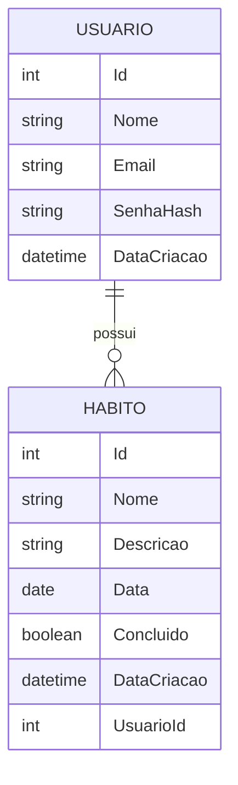

# Diagrama Entidade-Relacionamento

Este diagrama representa as entidades persistidas no banco de dados e o relacionamento entre usuários e hábitos.

```mermaid
erDiagram
    USUARIO ||--o{ HABITO : possui

    USUARIO {
        int Id
        string Nome
        string Email
        string SenhaHash
        datetime DataCriacao
    }

    HABITO {
        int Id
        string Nome
        string Descricao
        date Data
        boolean Concluido
        datetime DataCriacao
        int UsuarioId
    }
```
